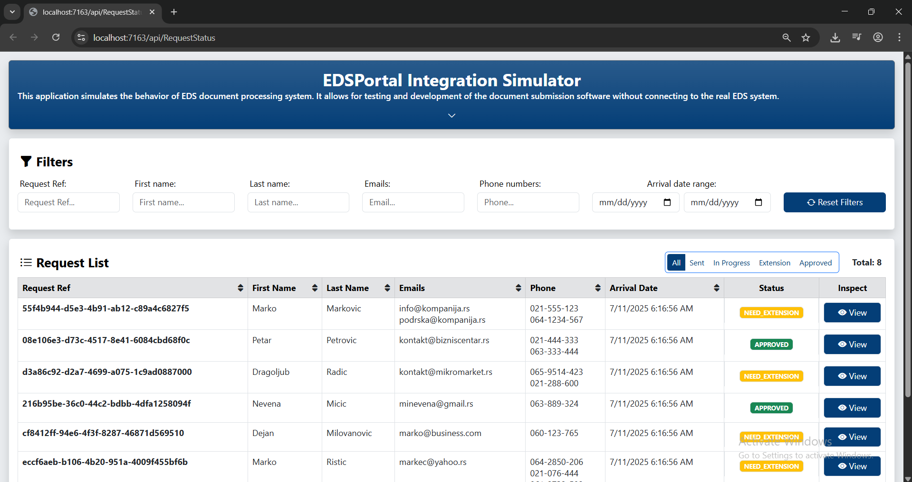
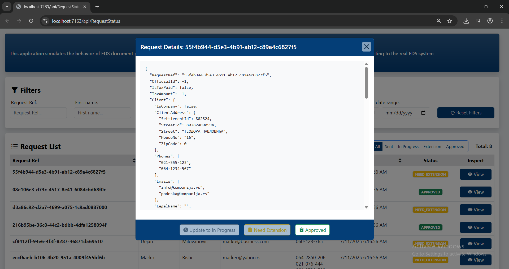

# ⚡ EDS Portal Integration Simulator

Integration simulator for **Elektro Distribucija Srbije (EDS)** platform developed during an internship program. This simulator was created to simulate the document processing workflow while the main document processing component is still under development by another company.

## 🎯 Project Purpose

The EDS Portal consists of two main components:
- **Frontend application** (C# + Angular) - for user registration, login, request status tracking, and request submission
- **Backend document processing system** (under development by another company)

This simulator serves as a **temporary solution** that mimics the backend system functionality until the actual system development is completed.

## 🚀 Features

- **View all requests** - Complete list of consumer registration requests
- **Filter requests** - Search and filter by various criteria
- **Sort requests** - Organize requests by date, status, type, etc.
- **Status management** - Change request statuses to simulate processing progress
- **Progress tracking** - Simulate different phases of request processing
- **RESTful API** - Endpoints for communication with the main EDS application

## 🛠️ Technologies Used

- **C# (.NET Core/Framework)** - Backend logic
- **ASP.NET Core Web API** - RESTful service
- **Entity Framework** - ORM for database operations
- **SQL Server** - Database
- **JSON** - Data exchange format

## 📁 Project Structure

```
Sotex.EDSPortal.IntegrationSimulator/
├── bin/                    # Executable files
├── Controllers/           # Web API controllers
├── Data/                  # Database context
├── IntegrationData/       # Integration data
├── Models/               # Domain models
├── obj/                  # Object files
├── Properties/           # Project properties
├── SharedDTOs/           # Shared Data Transfer Objects
├── Uploads/              # Uploaded files
├── Views/                # Razor views (if any)
├── Program.cs            # Main application class
├── appsettings.json      # Application configuration
├── requestList.json      # Request list for testing
├── requestStatusList.json # Status data
└── *.csproj             # Project files
```

## 📸 Screenshots

**Home Page**


**Status Change**


## 🔧 Installation & Setup

1. **Clone the repository**
   ```bash
   git clone https://github.com/sav0sav1c5/eds-integration-simulator.git
   cd eds-integration-simulator
   ```

2. **Restore NuGet packages**
   ```bash
   dotnet restore
   ```

3. **Configure database**
   - Open `appsettings.json`
   - Update the connection string for SQL Server

4. **Run migrations** (if any)
   ```bash
   dotnet ef database update
   ```

5. **Run the application**
   ```bash
   dotnet run
   ```

6. **Access the application**
   - API endpoints available at: `https://localhost:[port]`
   - Swagger documentation (if enabled): `https://localhost:[port]/swagger`

## 🔄 Process Simulation

The simulator enables simulation of different request processing phases:

1. **Newly Received** - Request has just been submitted
2. **In Progress** - Documents are being processed
3. **Requires Supplements** - Additional documents needed
4. **Approved** - Request has been approved
5. **Rejected** - Request has been rejected

## 🎯 Project Goal

This simulator is a **temporary solution** that enables:
- Continuous development and testing of the main EDS application
- Simulation of backend system operations before its completion
- Testing communication between frontend and backend components
- Functionality validation without waiting for the final implementation

## 📚 Credits & Notes

- Project developed during internship program
- Serves as a simulator for testing and development
- Data is stored locally and used only for simulation purposes
- Will be replaced by the actual backend system once development is complete

*This project was created as part of an internship program for Elektro Distribucija Srbije (EDS).*